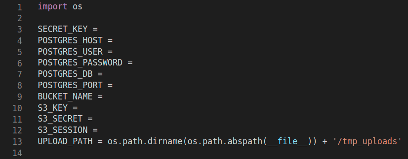

# validador-de-documentos
Terceiro trabalho da disciplina de Desenvolvimento de Software na Nuvem

### OBS: O arquivo `app/validador-de-documentos/config.py` não está aqui por questões de segurança, mas ele segue esse formato:

## Como usar

1. Baixe esse repositório e navegue até ele
2. Mude a branch: `$ git checkout trab3-docker`
3. Coloque um arquivo `config.py` em [app/validador-de-documentos/](https://github.com/titowoche30/validador-de-documentos/tree/trab3-docker/app/validador-de-documentos)
4. Execute: `$ unzip db-data/data.zip` 
5. Execute: `$ docker-compose up` se desejar ver os logs, caso não, execute `$ docker-compose up -d`

    **OBS: por conta do Pandas, a imagem do app demora cerca de 25 minutos pra terminar o build.**
    
5. Acesse: http://localhost:5000
6. Para encerrar: Se executou vendo os logs, dê um `CTRL+C` nesse terminal e `$ docker-compose down` logo em seguida. Caso não tenha executado com logs, basta um `$ docker-compose down`
7. Para executar de novo: Basta repetir o passo 5  

**A aplicação será iniciada com os dados de exemplo do banco Postgres da pasta [db-data/](https://github.com/titowoche30/validador-de-documentos/tree/trab3-docker/db-data), caso queria que a aplicação seja iniciada com um banco de dados vazio, siga esses passos:**

1. Baixe esse repositório
2. Mude a branch: `$ git checkout trab3-docker`
3. Coloque um arquivo `config.py` em [app/validador-de-documentos/](https://github.com/titowoche30/validador-de-documentos/tree/trab3-docker/app/validador-de-documentos)
4. Comente o volume do service postgres-trab3 (linhas 7 e 8) de [docker-compose.yml](https://github.com/titowoche30/validador-de-documentos/blob/trab3-docker/docker-compose.yml)
5. Mude o command do app-trab3, ou seja, comente a linha 24 e descomente a linha 25 de [docker-compose.yml](https://github.com/titowoche30/validador-de-documentos/blob/trab3-docker/docker-compose.yml)
6. Execute: `$ docker-compose up` se desejar ver os logs, caso não, execute `$ docker-compose up -d`

    **OBS: por conta do Pandas, a imagem do app demora cerca de 25 minutos pra terminar o build.**
    
7. Acesse: http://localhost:5000
8. Para encerrar: Se executou vendo os logs, dê um `CTRL+C` nesse terminal e `$ docker-compose down` logo em seguida. Caso não tenha executado com logs, basta um `$ docker-compose down`
9. Para executar de novo: Basta repetir o passo 6
 
